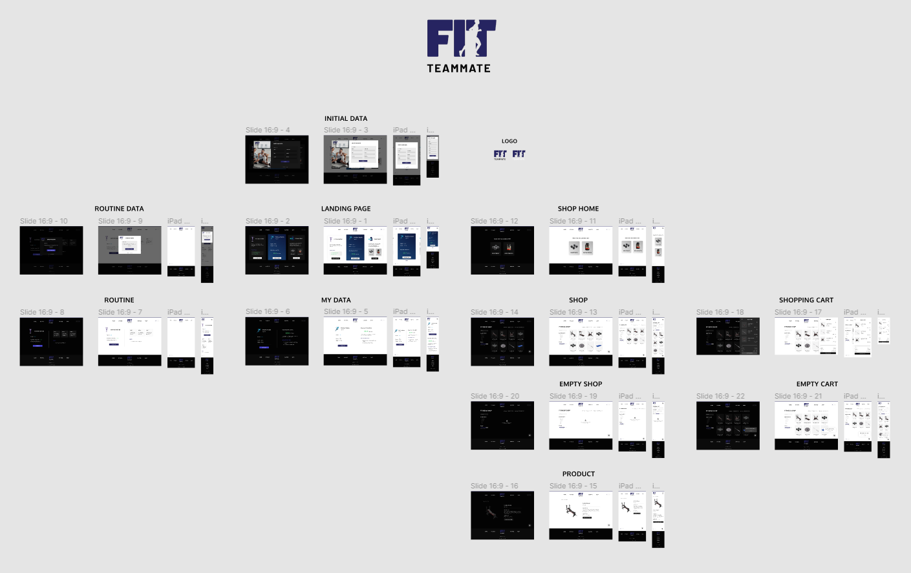

<div style="margin-bottom: 2em">
    
</div>

**Fitteamate** is a web application developed with vanilla JavaScript dedicated to fitness where the user enters their data and calculates their BMI (Body Mass Index), gives advice or tips on diet and exercise and also builds a personalized routine for you. On the other hand, it has an Ecommerce where you can find a wide variety of products for fitness. You can visit the [**Website**](https://mathiramilo.github.io/Fit-Teammate) and see it for yourself.

# Features

1. **`BMI Calculator`** (Calculates users BMI (Body Mass Index) based on their data)
2. **`Custom Routine`** (Users can ask for a custom routine, this is built taking into account their data and how many days a week can they train)
3. **`Diet and Excercise Tips`** (Users receive tips on diet and exercise depending on their data)
4. **`Fitness Shop`** (There is shop where users can find a wide variety of products for fitness)
5. **`Filter Products`** (Users can filter the products by category, type and price)
6. **`Search Products`** (Users can search for products by his name)
7. **`Order Products`** (Users can order the products by relevance, name or price)
8. **`Dark Mode`** (Users can change between light and dark mode depending on their preference)

# UI/UX Design

### `Full responsive and modern design`

To obtain this great result, I designed each page and each element of this website in a complete and detailed way. To carry out this task I use [**Figma**](https://www.figma.com/).


Global Design

# Technical Information

## Framework

* **`No Framework`**

## Languages

* **`JavaScript`** (World's most popular programming language and the programming language of the Web)
* **`HTML5`** (Standard markup language for Web pages)
* **`CSS3`** (Cascading Style Sheets (CSS) is a style sheet language used for describing the presentation of a document written in a markup language such as HTML or XML)
* **`SASS`** (Preprocessor scripting language that is interpreted or compiled into CSS)

## Libraries

* **`SweetAlert JS`** (Used to obtain a better communication with the user through alerts of certain actions, give information or alert errors)

```js
/* Display a Sweet Alert when the user complete the purchase */
const finishBuyingButton = document.getElementById('finish-buying-button');
finishBuyingButton.onclick = () => {
  Swal.fire({
    title: 'PURCHASE COMPLETED',
    text: 'Thank you for your purchase! We wait for you again any time you want',
    showConfirmButton: false,
    timer: 3000,
    imageUrl: '../assets/images/icons/check-circle.svg',
    imageWidth: 100,
    allowOutsideClick: false
  })

  cartOverlay.style.transform = "translateX(460px)"; 

  cart.checkout()
  cartLoadData()

  sessionStorage.setItem('cart', JSON.stringify(cart.products))

  setTimeout(() => location.replace("../index.html"), 3200)
}
```

# General Information

### `Final Project of Coderhouse JavaScript Course`

* Developed by **Mathias Ramilo**.

### **Personal Data**

* Visit my [**GitHub**](https://github.com/mathiramilo) profile to see more amazing projects.
* If you are interested, contact me on [**Linkedin**](https://www.linkedin.com/in/mathias-ramilo/).
